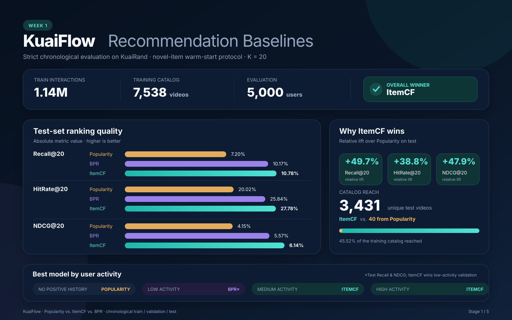

# KuaiFlow

KuaiFlow is a reproducible, multi-stage short-video recommendation project built
on the KuaiRand dataset. The project starts with trustworthy implicit-feedback
baselines, then develops toward two-tower retrieval, multi-task ranking, and an
exposure-bias audit using randomized recommendations.

## Why this project

Many portfolio recommenders stop at a MovieLens notebook. KuaiFlow is organized
around the components and evaluation questions of a production recommender:

1. candidate retrieval;
2. multi-objective ranking;
3. diversity-aware reranking;
4. robustness under a different exposure policy.

Week one establishes the data and evaluation foundation with Popularity, ItemCF,
and Bayesian Personalized Ranking (BPR) baselines.

## Current scope

- Strict chronological train/validation/test split.
- Random-exposure log reserved for a later bias audit.
- Popularity and ItemCF baselines.
- BPR matrix factorization implemented from scratch in NumPy.
- Feature- and history-aware two-tower retrieval.
- Exact and FAISS approximate-nearest-neighbor retrieval evaluation.
- Recall@K, HitRate@K, NDCG@K, and catalog coverage.
- Explicit novel-item, warm-start evaluation rather than mixing in impossible
  cold-start targets.
- Deterministic toy demo and unit tests.

## Repository layout

```text
configs/                 Experiment configuration
data/raw/                Downloaded KuaiRand-Pure files (not tracked)
data/processed/          Chronological data splits (not tracked)
artifacts/               Benchmark results (not tracked)
src/kuaiflow/            Data, models, metrics, and CLI
tests/                    Unit and smoke tests
```

## Project milestones

The work is organized as a sequence of milestones. Week 1 establishes the data,
evaluation, and baseline foundation. Week 2 builds on that foundation with
learned retrieval and scalable nearest-neighbor search.

1. **Week 1 — Recommendation baselines:** chronological data preparation,
   warm-start evaluation, Popularity, ItemCF, and BPR.
2. **Week 2 — Two-tower retrieval:** feature and history ablations, followed by
   exact-versus-FAISS latency and fidelity evaluation.

## Week 1 — Recommendation baselines

Week 1 creates the reproducible evaluation pipeline and establishes three
implicit-feedback baselines. See the [Week 1 implementation plan](docs/week1.md)
and [full experimental report](docs/week1_results.md).

### Benchmark results

All models are evaluated at \(K=20\) on 5,000 users. The evaluation uses novel warm-start positives and a training catalog containing 7,538 videos. Users with no positive training interactions are retained and reported separately as the `zero_positive` group.

Higher values are better for every metric.

|   Split    | Model      | Recall@20 ↑ | HitRate@20 ↑ | NDCG@20 ↑ | Coverage@20 ↑ | Unique Items |
| :--------: | :--------- | ----------: | -----------: | --------: | ------------: | -----------: |
| Validation | Popularity |       7.95% |       20.18% |     4.45% |         0.56% |           42 |
| Validation | BPR        |      10.19% |       25.78% |     5.78% |        16.26% |        1,226 |
| Validation | **ItemCF** |  **11.58%** |   **28.26%** | **6.76%** |    **47.05%** |    **3,547** |
|    Test    | Popularity |       7.20% |       20.02% |     4.15% |         0.53% |           40 |
|    Test    | BPR        |       9.99% |       25.52% |     5.45% |        18.16% |        1,369 |
|    Test    | **ItemCF** |  **10.78%** |   **27.78%** | **6.14%** |    **45.52%** |    **3,431** |

See the [full Week 1 experimental report](docs/week1_results.md) or continue to
the [Week 2 two-tower retrieval report](docs/week2_results.md).



### Key findings

- ItemCF performs best across all ranking and coverage metrics.
- On the test set, ItemCF improves Recall@20 by 49.7% and HitRate@20
  by 38.8% relative to the popularity baseline.
- BPR consistently improves over popularity, but remains behind ItemCF under
  the initial untuned configuration.
- Popularity recommends only 40 distinct test items, while ItemCF reaches
  3,431, demonstrating the importance of personalization for catalog coverage.
- Validation and test results are similar, suggesting that the model comparison
  is reasonably stable across the two future time periods.

### Run Week 1

Create a Python 3.10+ environment and install the package:

```bash
python -m venv .venv
source .venv/bin/activate
python -m pip install -e .
```

Run the synthetic end-to-end demo and test suite:

```bash
kuaiflow demo
python -m unittest discover -s tests -v
```

Download and verify KuaiRand-Pure from the dataset's official Zenodo record:

```bash
kuaiflow download --config configs/week1.yaml
```

Prepare the strict chronological splits:

```bash
kuaiflow prepare --config configs/week1.yaml
```

Run every week-one baseline:

```bash
kuaiflow benchmark --config configs/week1.yaml
```

Results are written to `artifacts/week1_results.json` and
`artifacts/week1_results.csv`.

To iterate more quickly, run only selected models:

```bash
kuaiflow benchmark --config configs/week1.yaml --models popularity itemcf
```

## Week 2 — Two-tower retrieval and FAISS

Week 2 follows the same chronological warm-start protocol established in Week
1, replacing hand-designed retrieval scores with a learned two-tower model. It
then compares exact retrieval with FAISS Flat, IVF, and HNSW indexes. See the
[Week 2 implementation plan](docs/week2.md) and
[full experimental report](docs/week2_results.md).

### Run Week 2

Install the optional CPU FAISS dependency before running a FAISS experiment:

```bash
python -m pip install -e ".[faiss]"
```

Run the final feature- and history-aware model with the selected IVF index:

```bash
kuaiflow retrieval --config configs/week2_faiss_ivf.yaml --mode faiss
```

Run the exact, FAISS Flat, IVF, and HNSW latency/accuracy comparison. The model
is trained once and reused by every retrieval backend:

```bash
OMP_NUM_THREADS=1 kuaiflow retrieval \
  --config configs/week2_feature_history.yaml --mode tradeoff
```

The comparison is written to `artifacts/faiss_tradeoff_analysis.json` and
`artifacts/faiss_tradeoff_comparison.csv`.

In addition to downstream Recall/NDCG, the comparison directly measures ANN
fidelity against exact retrieval: candidate Recall@K, rank-sensitive candidate
NDCG@K, final-list overlap after filtering, and complete ordered-list match rate.
The selected IVF-100/10 configuration recovers 86.49% of exact top-100
candidates while making candidate search about 2.8x faster.

The selected Week 2 run also persists its final ordered candidate lists as
`data/processed/candidates/week2_feature_history_faiss_ivf_top100.csv.gz`.
The path is declared by `data.candidates_path` in the selected configuration.
Each row contains the split, user ID, video ID, and one-based retrieval rank.
This generated dataset is the explicit retrieval-to-ranking handoff for Week 3;
the downstream ranker learns its own score rather than taking the retrieval
score as an input feature.

The latency comparison uses one warmup followed by five measured runs. It
reports median and p95 latency at three matching boundaries for every backend:

- `search`: precomputed user embeddings through candidate search;
- `pipeline`: candidate search plus seen-item filtering and fallback;
- `end_to_end`: user embedding generation through search and post-processing.

Index construction is reported separately because it is an offline operation.
Change `latency_warmup_runs` and `latency_measured_runs` under `evaluation` in
the YAML configuration to control the benchmark. `OMP_NUM_THREADS=1` makes CPU
threading explicit and reproducible; use the same value whenever comparing
results from different runs.

## Week 3 — DeepFM ranking

Week 3 starts with a standalone DeepFM click model. It trains on logged
impressions, then scores and reorders the selected Week 2 top-100 candidates
without changing candidate membership. Its linear, FM, and deep branches are
optimized jointly with one binary click loss. See the
[DeepFM guide](docs/week3_deepfm.md) for the model equation, leakage rules, and
evaluation protocol.

```bash
OMP_NUM_THREADS=1 kuaiflow deepfm --config configs/week3_deepfm.yaml
```

The first full run reached 0.7195 test click AUC. Over the fixed candidates it
improved test NDCG@20 by 19.2% and HitRate@20 by 40.2%, while reducing
Coverage@20 from 84.1% to 38.7%; the full trade-off is reported in the guide.

The next saved baseline combines DeepFM's linear/FM branches with an MMoE deep
branch. It jointly learns click, like, follow, comment, forward, long-view,
profile-entry, hate, watch-time, and completion heads, then applies an explicit
configurable utility policy to the same Week 2 top 100. See the
[DeepFM + MMoE guide](docs/week3_mmoe.md) for the architecture, exact losses,
leakage constraints, first-run results, and resume point.

```bash
OMP_NUM_THREADS=1 kuaiflow mmoe --config configs/week3_mmoe.yaml
```

Collection is deliberately absent: KuaiRand-Pure has no per-impression
collection label, and its month-aggregated collection statistics are not safe
training targets or request-time features.

CLI modes are explicit: `standard` rejects configurations containing `faiss`,
`faiss` requires a non-empty `faiss` block, and `tradeoff` uses its own fixed
index matrix and therefore rejects a single-index `faiss` block.

## Evaluation notes

The raw standard-policy files contain a small timestamp overlap at their
boundary. Preprocessing conservatively removes 47 future rows whose timestamps
are not later than the final training timestamp, preserving a strictly
chronological evaluation.

The default positive signal is `is_click`. In KuaiRand this represents a click
for the two-column interface and a valid play for the single-column interface.
The later randomized-exposure log is intentionally excluded from training and
model selection.

The main benchmark removes training-seen positives from each user's ground truth
and restricts evaluation to items present in the training catalog. This protocol
measures novel-item recommendation under a warm-start setting; cold-start items
will be evaluated separately after content features are added.

Randomized exposures will first be used as a robustness and calibration audit.
The project will not claim unbiased off-policy evaluation without explicitly
accounting for the relevant logging propensities.

## Roadmap

- **Week 1 — Complete:** data pipeline, chronological evaluation, Popularity,
  ItemCF, and BPR.
- **Week 2 — Complete:** feature/history-aware two-tower retrieval, controlled
  ablations, and matched exact-versus-FAISS latency evaluation.
- **Week 3 — In progress:** trained DeepFM and DeepFM + MMoE rankers over the
  Week 2 top-100 candidates; DIN is the next ablation.
- **Week 4:** random-exposure bias audit and calibrated evaluation.
- **Week 5:** diversity-aware reranking, FAISS serving, and final report.

## Dataset

KuaiRand is released by Gao et al. under CC BY-SA 4.0. This repository does not
redistribute the dataset. Download instructions, field definitions, and citation
information are available from the
[official KuaiRand repository](https://github.com/chongminggao/KuaiRand).

## License

Code in this repository is released under the MIT License. The KuaiRand dataset
has its own CC BY-SA 4.0 license and attribution requirements.
