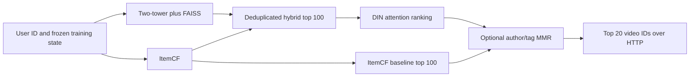

# KuaiFlow: final five-week project report

**A multi-stage short-video recommendation prototype on KuaiRand-Pure**  
Author: Shaotian Sun · September 27, 2026  
Implementation checkpoint: `538fdfb`, following experiment checkpoint `6c66cb0`.

## Executive summary

KuaiFlow implements a complete offline recommendation workflow: chronological
data preparation, baseline recommenders, two-tower retrieval with FAISS,
DeepFM/DIN and multi-task ranking, exposure-specific probability calibration,
diversity-aware reranking, and a local HTTP recommendation service. The five-week
engineering scope is complete. The system uses frozen training state at serving
time; it has not been deployed to live traffic.

The strongest measured click-ranking policy is **ItemCF alone**, with test
NDCG@20 of **6.141%**. On the same evaluation users, hybrid two-tower/ItemCF
retrieval reaches **3.885%** in its original order; applying the mean-pooling
neural ranker reduces this to **3.253%**, while DIN attention reaches **3.386%**.
Thus, adding a learned stage does not establish an improvement over the strongest
baseline. ItemCF is the default service profile; the full neural pipeline remains
available for experimentation.

Three further findings guide the implementation. Attention has only a small
observed test advantage over matched mean pooling. Calibration substantially
improves probability quality when fitted to the relevant exposure distribution,
but does not fix single-head ranking. Diversity reranking increases topic variety
while introducing a measurable relevance tradeoff, so it is opt-in. The project
delivers both the working architecture and evidence for choosing which stages
to enable. [Pipeline comparison](pipeline_improvement_results.md),
[Week 5 results](week5_results.md).

## 1. Objective and completed scope

The project reproduces the major stages and evaluation decisions of an industrial
recommender at a scale that can run locally. Each milestone has an implementation,
saved experimental results, and an explicit evaluation boundary.

| Milestone | Delivered capability | Evidence |
| --- | --- | --- |
| Week 1 | Chronological splits; Popularity, ItemCF, and BPR; warm-catalog novel-item evaluation | [Baseline report](week1_results.md) |
| Week 2 | Feature/history-aware two-tower; exact and FAISS retrieval; candidate handoff; subsequent history correction | [Corrected retrieval report](retrieval_budget_results.md) |
| Week 3 | DeepFM, DIN, DeepFM+MMoE, DIN+MMoE; matched pooling and scoring comparisons | [Ranking](week3_results.md), [pooling](pooling_ablation_results.md), [MMoE](mmoe_pooling_ablation_results.md) |
| Week 4 | Frozen-model standard/random exposure audit and Platt calibration | [Calibration report](week4_results.md) |
| Week 5 | Author/tag diversity reranking; local API; exact HTTP replay; latency measurement | [Serving and reranking report](week5_results.md) |

Completion means these stages are implemented, connected where appropriate,
and evaluated. It does not require the most complex architecture to win every
metric. Production deployment, live feature updates, and online experiments are
outside this milestone.

## 2. Data and evaluation design

The standard log contains **1,141,112 training impressions**, **26,210 training
users**, and **7,538 training videos**. Training spans April 9–21, 2022;
validation and test contain 147,725 impressions each in the subsequent periods.
Preprocessing removes 47 overlapping future rows to enforce a strict temporal
boundary. The separate randomized log is excluded from base-model training;
Week 4 uses an early portion for calibration and a later portion for evaluation.
[Data protocol](week1_results.md), [calibration cohorts](week4_results.md).

Two different evaluation questions are kept separate:

- **Logged-impression prediction:** predict observed click and engagement labels;
  assess ROC-AUC, log loss, Brier score, and calibration. The rankers train on
  logged positive and negative impressions without adding unexposed candidates
  as synthetic negatives.
- **Recommendation ranking:** rank videos for 5,000 users per future split;
  assess NDCG@20, Recall@20, HitRate@20, and catalog coverage. Relevant items are
  future logged positives in the training catalog, excluding training-clicked
  videos. Unobserved candidate outcomes are unknown, although they contribute
  no observed relevance gain in this offline metric.

NDCG rewards placing relevant videos early. Recall measures the fraction of
eligible positives recovered; coverage measures how much of the catalog appears
across recommendation lists. A useful logged-impression predictor can still be
a poor ranker over retrieved candidates: the candidate distribution and the
evaluation objective differ.

Encoders, feature transformations, item similarities, and histories use training
data only. Training histories exclude the current event and all equal-time events;
validation, test, and serving histories remain frozen at the training cutoff.
Month-aggregated engagement statistics are excluded because they lack a safe
request-time availability boundary.

Later policy searches use 2,500 validation users for tuning and the remaining
2,500 for confirmation. These periods had already been examined during project
development. Confirmation therefore checks the frozen choice on different users,
but is not a newly collected, independent holdout. Test metrics did not select
the reported model or reranking settings.

## 3. Architecture and implementation

The complete neural serving path is:



The ItemCF service profile follows the baseline branch and skips the two-tower
and DIN. The neural profile uses both retrieval sources before DIN scoring.
DeepFM and MMoE are evaluated offline alternatives, rather than additional
sequential stages in this serving graph. Calibration is a separate audit and
adaptation step; the service does not assume a deployment exposure distribution
or automatically attach the randomized-exposure calibrator.

### Retrieval

ItemCF builds cosine neighborhoods from training-positive user–video
interactions, retains 100 neighbors per item, and aggregates similarity from a
user's clicked videos. Training popularity breaks ties and supplies fallback
recommendations when history is unavailable.

The two-tower model learns user and video representations using IDs, static
features, and history. The selected configuration has 64-dimensional output
embeddings, a 20-item history limit, temperature 0.07, and ten training epochs.
Serving uses a FAISS IVF index with 100 lists and 10 probes, followed by
training-seen-item exclusion. The hybrid policy alternates candidates from
two-tower and ItemCF retrieval, removes duplicates, and retains 100 videos.
[Retrieval configuration](../configs/week2_faiss_ivf.yaml),
[ItemCF implementation](../src/kuaiflow/models/itemcf.py),
[serving pipeline](../src/kuaiflow/pipeline.py).

### DIN and the prediction head

For batch size `B`, DIN consumes seven categorical fields `[B, 7]`, three
numeric fields `[B, 3]`, and up to 30 historical video IDs `[B, 30]`. Categorical
fields include the user and current video IDs; each field has a 16-dimensional
embedding. Numeric values scale learned 16-dimensional field vectors.

The target video embedding `q` and each historical embedding `h_j` share the
video embedding table. The local activation network computes

\[
a_j=\operatorname{MLP}_{64\to64\to32\to1}
       ([q,h_j,q-h_j,q\odot h_j]),
\qquad v=\sum_j m_j a_j h_j.
\]

PReLU activates the hidden layers. The weights are **not softmax-normalized**
and may be negative. The mask removes padding, unknown, and missing history
IDs; an empty history yields a zero interest vector. The target item therefore
conditions which historical interactions contribute to `v`.

The prediction head receives all ten static field embeddings, including the
user and target video, **plus** the interest vector: `[B, 176]` in total.
Its MLP maps `176 → 128 → 64 → 1`, producing a click logit trained with
binary cross-entropy. DIN does not retain DeepFM's explicit linear and FM
branches. This is a DIN-style implementation using PReLU and AdamW rather than
an exact reproduction of every original training detail.
[DIN code](../src/kuaiflow/models/din.py), [history contract](week3_din.md).

### Multi-task ranking

DIN+MMoE sends the same 176-dimensional representation to four shared
`176 → 128 → 64` experts. Each of ten tasks has its own softmax gate over
those experts and a `64 → 32 → 1` prediction tower. DeepFM+MMoE instead combines
its expert branch with task-specific first-order terms and scaled FM interactions.

Eight heads use binary action losses: click, like, follow, comment, forward,
long view, profile entry, and hate. Watch time uses a weighted soft-label
logistic objective; completion uses a clipped watch-time/duration target and
masks invalid duration. Losses are normalized by training-set constant-predictor
losses before aggregation. Fixed composite policies combine predicted outcomes;
they are not presented as optimized business utility. [MMoE objectives](week3_mmoe.md),
[DIN+MMoE implementation](../src/kuaiflow/models/din.py).

## 4. Principal experimental findings

### 4.1 Current end-to-end comparison

These values use the same test cohort and relevance definition, with corrected
retrieval histories where the two-tower is used. Candidate sources intentionally
differ between retrieval strategies. Within each hybrid ranking comparison,
the top-100 membership is fixed. Percentages below are metric values, not lift.

| Strategy | NDCG@20 (%) | Recall@20 (%) | Coverage@20 (%) |
| --- | ---: | ---: | ---: |
| Two-tower retrieval order | 1.279 | 2.510 | 84.770 |
| Hybrid retrieval order | 3.885 | 7.690 | 79.464 |
| Hybrid + mean-pooling ranker | 3.253 | 6.594 | 20.509 |
| Hybrid + DIN attention | 3.386 | 6.797 | 21.611 |
| Hybrid + DIN attention + MMR | 3.365 | 6.851 | 26.784 |
| **ItemCF baseline** | **6.141** | **10.781** | 45.476 |
| ItemCF + MMR | 5.804 | 10.266 | 47.639 |

Sources: [source/ranker comparison](pipeline_improvement_results.md) and
[fresh attention-DIN and MMR evaluation](week5_results.md).

A 36-policy validation search over source fusion and neural-score blending
selected ItemCF alone. Its test NDCG advantage over unranked hybrid retrieval is
**2.256 percentage points**, with a paired user-bootstrap 95% interval of
**[2.071, 2.452]** points. This restores an already strong baseline; it is not a
new model improvement over ItemCF. The interval conditions on the fitted models
and chosen policy and does not include training or search uncertainty.

The result establishes which implemented policy works best for this benchmark.
It does not establish that ItemCF is universally better than neural retrieval
or ranking. Possible explanations include the logged-impression versus
candidate-ranking mismatch, incomplete histories, limited feature information,
and loss of useful retrieval-order information in the standalone neural ranker.
These are hypotheses for further experiments, not isolated causal explanations.

### 4.2 Historical matched pooling and MMoE ablations

The controlled pooling study uses the same features, history rules, prediction
head dimensions, and candidate lists across three seeds. Attention has the
highest average validation NDCG@20. On test, attention reaches **1.9893%** versus
**1.9840%** for mean pooling, a difference of **0.0053 percentage points**.
Mean local training-plus-validation time is **8.18 seconds** for mean pooling
and **39.83 seconds** for attention. This supports retaining mean pooling as an
economical baseline; it does not establish a substantial attention benefit.

The MMoE study also uses three seeds. Test click NDCG@20 is **1.9840%** for
single-task mean pooling, **1.9092%** for mean MMoE click scoring, and **1.9321%**
for attention MMoE click scoring. Fixed composite scoring improves some
like/profile-entry metrics relative to the corresponding MMoE click policy,
while lowering click/long-view ranking. Single-task versus MMoE comparisons also
differ in losses and training settings; only the within-family pooling ablation
isolates the pooling change.

**Provenance matters:** these ablations retain the historical Week 2 candidate
snapshot, created before the two-tower timestamp-tie fix. Their within-snapshot
comparisons remain documented, but the absolute scores are not fresh evaluations
of the corrected serving pipeline. Three-seed variability is not a population
confidence interval. [Pooling evidence](pooling_ablation_results.md),
[MMoE evidence](mmoe_pooling_ablation_results.md).

### 4.3 Retrieval recall and the ranking ceiling

The retrieval audit identified a training-history issue: clicks sharing a
timestamp could enter one another's two-tower history. Strict timestamp
exclusion fixed it, and subsequent retrieval experiments use the corrected model.
Historical results were preserved and marked rather than silently overwritten.

With that corrected retriever and the frozen mean-pooling ranker, increasing
the budget from 100 to 500 improves test candidate recall from **10.133%** to
**32.176%**, yet lowers final NDCG@20 from **1.924%** to **1.806%**. The larger
candidate set contains more positives, but the ranker cannot reliably promote
them into the top 20.

For the selected hybrid top 100, oracle NDCG@20 is **28.817%**, compared with
**3.253%** achieved by the mean-pooling ranker. The oracle orders candidates using
held-out labels while retaining the full eligible-positive denominator. It is
a diagnostic ceiling for that candidate set, not an attainable serving result,
a predicted gain, or a target learned from test labels.
[Budget and oracle report](retrieval_budget_results.md).

### 4.4 Calibration under exposure shift

Week 4 holds all four rankers fixed and fits monotone Platt maps
`sigmoid(a * logit + b)` to standard or early randomized impressions. It evaluates
them on later, time-aligned cohorts. For DIN on randomized test impressions,
raw mean predicted click probability is **45.25%**, while observed click rate is
**17.99%**. Random-fitted calibration changes the mean prediction to **17.39%**
and log loss from **0.6500** to **0.4482**.

That same random-fitted map worsens standard-test DIN log loss from **0.6142**
to **0.7905**. Standard-fitted calibration instead improves it to **0.6090**.
Calibration therefore depends on the exposure distribution. A positive-slope
map preserves single-head score order and cannot resolve the ranking deficit.
The experiment measures probability quality, not causal exposure effects or
unbiased policy value; no logging propensities or IPS/DR estimator are used.
[Calibration results and uncertainty](week4_results.md).

### 4.5 Diversity and relevance

The MMR reranker selects candidates greedily using base-rank percentile as
relevance and a similarity combining shared author and tag-set Jaccard overlap.
Validation chooses the greatest mean tag diversity subject to retaining at least
98% of the corresponding baseline NDCG. The 2% allowance is an explicit
illustrative product constraint, not an empirically established business budget.

Strength 0.4 is selected for both profiles. On test, ItemCF tag diversity rises
from **0.8058 to 0.9132**, but NDCG falls from **6.141% to 5.804%**, retaining
only **94.51%** of baseline NDCG. The constraint also fails on confirmation
users. Consequently, the serving default preserves the baseline order, and
the measured diversity setting is enabled only explicitly.

For hybrid DIN, tag diversity rises from **0.7991 to 0.9026**, with **99.38%**
test NDCG retention. Its paired NDCG change interval includes zero. Diversity
metrics describe metadata variety, not demonstrated satisfaction or online
engagement. No setting was retuned on test. [Full tradeoff](week5_results.md).

## 5. Serving, verification, and reproduction

HTTP makes the pipeline callable by another application: a client sends user IDs
and a requested list length, and receives ordered video IDs as JSON. It changes
how the recommender is accessed, not its recommendation quality.

The service binds to `127.0.0.1`, verifies artifact hashes at startup, accepts
up to 100 user IDs per request, rejects invalid inputs, collapses duplicate user
IDs, and supports training-popularity fallback for unknown users. `itemcf` is
the default profile; `hybrid_din --diversity` runs the complete neural path.

| Local HTTP configuration | Median one-user request (ms) | Observed p95 (ms) | Exact replay users |
| --- | ---: | ---: | ---: |
| ItemCF baseline | 2.747 | 3.026 | 128 |
| ItemCF + MMR | 2.755 | 2.926 | 128 |
| Hybrid + DIN | 16.077 | 16.517 | 128 |
| Hybrid + DIN + MMR | 16.282 | 16.573 | 128 |

Each timing uses 32 sequential local requests after five warmups, excluding
startup and including HTTP/JSON overhead. These measurements do not represent
production p95 under concurrent load. Every configuration exactly reproduces
saved top-20 recommendations for 128 test users; checks also cover top-5 prefixes,
unknown users, request validation, and duplicate handling.

The implementation checkpoint passed **90 tests** across data boundaries,
models, candidate integrity, calibration, reranking, and serving inputs. Artifact
checks cover finite scores, candidate membership, complete ranks, causal history,
and checkpoint reload. The HTTP replay is an additional integration check.
[Serving evidence](week5_results.md), [tests](../tests/test_week5.py).

With the local data and verified model artifacts available, run from the repo:

```bash
OMP_NUM_THREADS=1 .venv/bin/python -m kuaiflow.serving --profile itemcf
# Or, in a separate terminal:
OMP_NUM_THREADS=1 .venv/bin/python -m kuaiflow.serving --profile hybrid_din --diversity --port 8001
```

The [operations guide](week5.md) provides the complete build order, API request
examples, and experiment commands. Large datasets and checkpoints are ignored
by Git; the code commits alone do not contain the weights required for exact
replay. Configurations and tracked reports retain the experiment specification;
local artifacts contain model state, input hashes, detailed scores, and metrics.

## 6. Limitations and next phase

The benchmark covers a restricted warm catalog and future logged positives.
Incomplete exposure and interaction histories prevent interpreting non-clicked
or unobserved recommendations as complete preference labels. Repeated use of the
same development periods also limits the strength of final generalization claims.
Most later pipeline results use one frozen training seed; bootstraps over users
do not measure retraining uncertainty. Rare-action MMoE metrics use small,
outcome-specific user cohorts and are unsuitable for broad safety or business
conclusions.

The service is a local demonstration with static training-cutoff histories. It
does not provide live event ingestion, a feature store, retraining orchestration,
authenticated public access, concurrent capacity guarantees, or online A/B tests.
These capabilities were not part of the completed five-week offline milestone.

The next phase should address concrete gaps in this order:

1. **Improve model/evaluation alignment:** retain ItemCF and raw retrieval order
   as controls; investigate source-aware ranking features and ranking objectives
   using an explicitly time-safe data protocol. Do not label every unexposed
   candidate as a negative.
2. **Strengthen generalization evidence:** reserve a genuinely new temporal
   holdout, repeat promising comparisons across training seeds, and assess
   activity and item-popularity segments before choosing a replacement policy.
3. **Extend the serving lifecycle if deployment is required:** define event-time
   feature updates, impression logging, monitoring, model versioning, concurrency
   tests, and an online experiment design.

The completed project demonstrates a functioning multi-stage architecture and
an evaluation process that can reject an unnecessary or harmful stage. Its
current operational decision is explicit: serve ItemCF by default, retain neural
models as measured alternatives, and expose diversity as a deliberate tradeoff.
