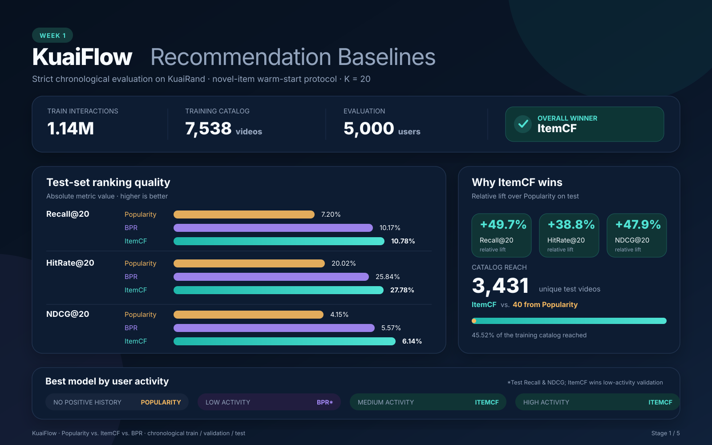

# KuaiFlow — Week 1 Baseline Results

Week 1 establishes a reproducible offline evaluation foundation for KuaiFlow, a
multi-stage short-video recommendation project built on KuaiRand. The goal is
not to claim a production-ready recommender, but to establish trustworthy
baselines and identify where personalization helps before moving to learned
retrieval and ranking models.



## 1. Experimental setup

The benchmark compares three implicit-feedback recommenders:

- **Popularity:** recommends globally popular videos and provides the fallback
  list for users without positive training history.
- **ItemCF:** scores candidates using item–item similarity derived from positive
  user interactions.
- **BPR:** a NumPy implementation of Bayesian Personalized Ranking matrix
  factorization trained with sampled pairwise objectives.

### Data split

| Split | Interactions | Users | Items | Click rate | Time range |
|---|---:|---:|---:|---:|---|
| Train | 1,141,112 | 26,210 | 7,538 | 46.34% | Apr 9–21, 2022 |
| Validation | 147,725 | 23,355 | 6,112 | 44.41% | Apr 21–30, 2022 |
| Test | 147,725 | 23,199 | 5,824 | 44.59% | Apr 30–May 8, 2022 |
| Random-exposure audit | 1,186,059 | 27,285 | 7,583 | 17.62% | Apr 22–May 8, 2022 |

The raw standard-policy files contain a small timestamp overlap at their
boundary. Preprocessing removes 47 future rows whose timestamps are not later
than the final training timestamp, preserving a strict chronological split.
The randomized log is reserved for a later exposure-bias audit and is not used
for model training or selection.

### Evaluation protocol

- Positive label: `is_click`.
- Ranking cutoff: `K = 20`.
- Deterministic evaluation sample: 5,000 users per future split.
- Training-seen positives are removed from each user's target set.
- Evaluation targets are restricted to the training catalog.
- Metrics: Recall@20, HitRate@20, NDCG@20, and catalog Coverage@20.
- Users with no positive training interactions use the Popularity fallback.

This is therefore a **novel-item, warm-start** benchmark. It does not measure
recommendation quality for items absent from the training catalog.

## 2. Overall benchmark

The table below reports the final ranking metrics. The corrected BPR values are
the exact macro averages over the four user-activity groups, which together
contain all 5,000 evaluated users.

| Split | Model | Recall@20 ↑ | HitRate@20 ↑ | NDCG@20 ↑ |
|:---:|---|---:|---:|---:|
| Validation | Popularity | 7.95% | 20.18% | 4.45% |
| Validation | BPR | 10.37% | 26.04% | 5.92% |
| Validation | **ItemCF** | **11.58%** | **28.26%** | **6.76%** |
| Test | Popularity | 7.20% | 20.02% | 4.15% |
| Test | BPR | 10.17% | 25.84% | 5.57% |
| Test | **ItemCF** | **10.78%** | **27.78%** | **6.14%** |

### Catalog reach

| Split | Model | Coverage@20 ↑ | Unique recommended items |
|:---:|---|---:|---:|
| Validation | Popularity | 0.56% | 42 |
| Validation | BPR | 12.36% | 932 |
| Validation | **ItemCF** | **47.05%** | **3,547** |
| Test | Popularity | 0.53% | 40 |
| Test | BPR | 13.44% | 1,013 |
| Test | **ItemCF** | **45.52%** | **3,431** |

On the test set, ItemCF improves over Popularity by **49.7% in Recall@20**,
**38.8% in HitRate@20**, and **47.9% in NDCG@20**. It recommends 3,431 distinct
videos, compared with only 40 from Popularity.

BPR provides a middle ground in catalog reach: its test recommendations cover
1,013 distinct videos, substantially more than Popularity but less than one
third of ItemCF's reach.

## 3. Performance by user activity

Users are grouped by the number of positive training interactions. The
`zero_positive` group contains users present in the training log but without a
positive training event; it is not the same as a completely unseen user.

### Test results

| Activity group | Users | Model | Recall@20 ↑ | HitRate@20 ↑ | NDCG@20 ↑ | Coverage@20 ↑ |
|---|---:|---|---:|---:|---:|---:|
| Zero positive | 230 | Popularity | **12.75%** | **29.57%** | **8.00%** | 0.27% |
|  |  | ItemCF | **12.75%** | **29.57%** | **8.00%** | 0.27% |
|  |  | BPR | **12.75%** | **29.57%** | **8.00%** | 0.27% |
| Low | 1,289 | Popularity | 8.56% | 17.46% | 4.77% | 0.33% |
|  |  | ItemCF | 12.18% | **24.67%** | 6.41% | **41.68%** |
|  |  | BPR | **12.49%** | 24.28% | **6.68%** | 10.72% |
| Medium | 1,570 | Popularity | 6.83% | 18.47% | 3.82% | 0.42% |
|  |  | ItemCF | **11.99%** | **29.36%** | **6.87%** | **19.37%** |
|  |  | BPR | 10.80% | 26.31% | 5.63% | 6.34% |
| High | 1,911 | Popularity | 5.92% | 21.87% | 3.55% | 0.53% |
|  |  | ItemCF | **8.61%** | **28.36%** | **5.13%** | **10.19%** |
|  |  | BPR | 7.77% | 26.06% | 4.48% | 8.17% |

### Interpretation

- All three models agree in the zero-positive group because ItemCF and BPR
  correctly fall back to the Popularity ranking.
- ItemCF is the strongest and most stable model for medium- and high-activity
  users, where richer histories support neighborhood-based personalization.
- BPR has the highest test Recall and NDCG in the low-activity group, although
  ItemCF wins this group on validation. This should be treated as a split-specific
  advantage rather than evidence that BPR is universally superior for sparse
  users.
- Popularity Recall decreases with activity, indicating that one global list
  covers a smaller fraction of the broader interests of highly active users.
- ItemCF produces substantially greater catalog coverage, particularly for
  low-activity users.

## 4. Performance by item popularity

Items are divided into `head`, `mid`, and `tail` groups using their positive
training frequency. Recommendation share measures the fraction of all top-20
recommendation slots assigned to a group; group coverage measures the fraction
of that group's catalog reached by the model.

### Test results

| Item group | Model | Recall@20 ↑ | HitRate@20 ↑ | NDCG@20 ↑ | Recommendation share | Group coverage |
|---|---|---:|---:|---:|---:|---:|
| Tail | Popularity | 0.00% | 0.00% | 0.00% | 0.00% | 0.00% |
|  | ItemCF | **0.90%** | **0.97%** | **0.36%** | 3.21% | **39.72%** |
|  | BPR | 0.00% | 0.00% | 0.00% | 0.37% | 7.25% |
| Mid | Popularity | 0.00% | 0.00% | 0.00% | 0.00% | 0.00% |
|  | ItemCF | **1.13%** | **1.44%** | **0.40%** | 2.98% | **39.29%** |
|  | BPR | 0.10% | 0.18% | 0.03% | 0.40% | 10.36% |
| Head | Popularity | 9.35% | 22.53% | 5.15% | 100.00% | 2.67% |
|  | ItemCF | **13.83%** | **30.53%** | **7.51%** | 93.81% | **69.59%** |
|  | BPR | 13.11% | 28.68% | 6.80% | 99.23% | 57.55% |

The recommendation distribution remains strongly head-dominated. ItemCF is the
only baseline that achieves non-trivial tail accuracy while also covering a
large fraction of the tail catalog. This motivates diversity-aware reranking
and exposure-bias analysis in later stages.

## 5. Main findings

1. **ItemCF is the strongest Week 1 baseline.** It wins every overall ranking
   metric and produces dramatically broader catalog reach than Popularity.
2. **Personalization matters.** Popularity reaches only 40 test items, while
   ItemCF reaches 3,431.
3. **User history changes model behavior.** BPR is competitive for sparse users,
   while ItemCF benefits more consistently from medium and high activity.
4. **The long tail remains difficult.** More than 93% of ItemCF recommendation
   slots and more than 99% of BPR slots still go to head items.
5. **Fallback behavior is part of model correctness.** Users without positive
   training interactions must not be scored with untrained latent vectors.

## 6. Limitations and next steps

- These are offline metrics under the standard logging policy; they do not
  establish causal or unbiased online performance.
- The benchmark uses a single positive signal and excludes cold-start items.
- BPR uses an initial, lightly tuned configuration rather than an extensive
  hyperparameter search.
- Results are reported on a deterministic 5,000-user evaluation sample.
- Randomized exposures and logging propensities are not yet incorporated.

Week 2 will build a two-tower retrieval model and efficient top-k candidate
generation. Later stages will add multi-task ranking, randomized-exposure bias
audits, and diversity-aware reranking.

## 7. Reproduction

```bash
kuaiflow prepare --config configs/week1.yaml
kuaiflow benchmark --config configs/week1.yaml
python -m unittest discover -s tests -v
```

The benchmark writes machine-readable JSON and CSV results to `artifacts/`.
