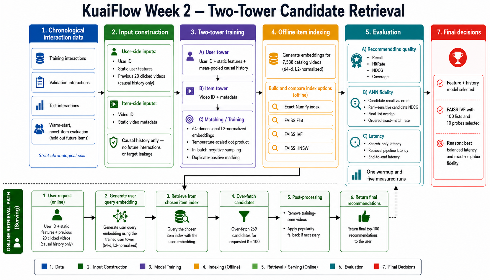
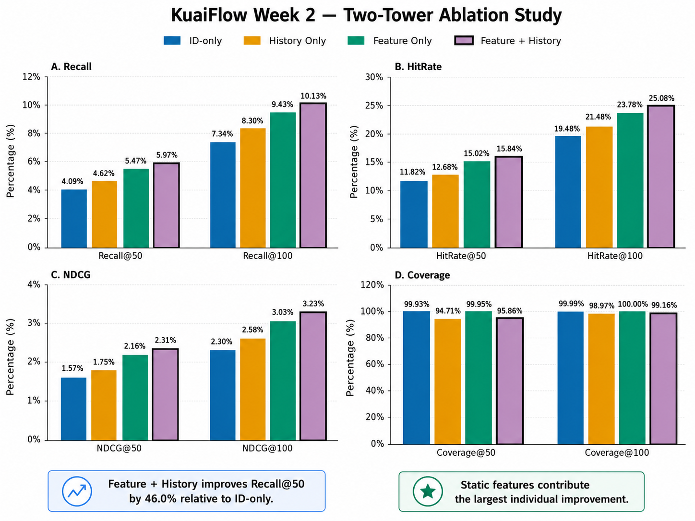
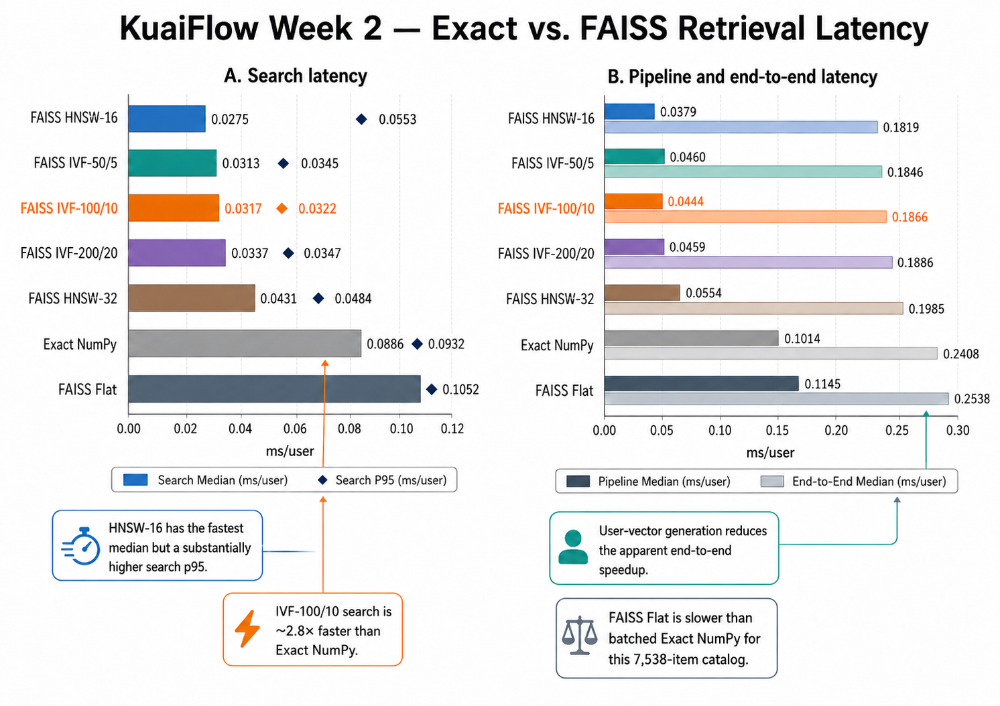
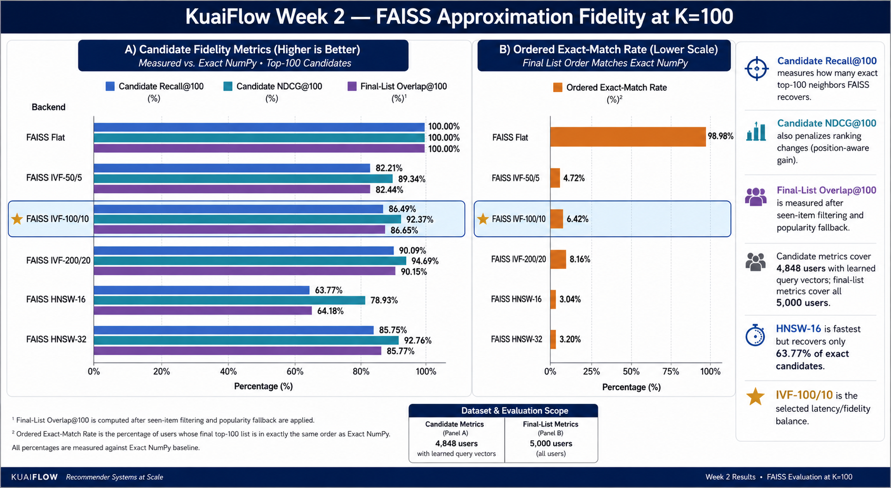
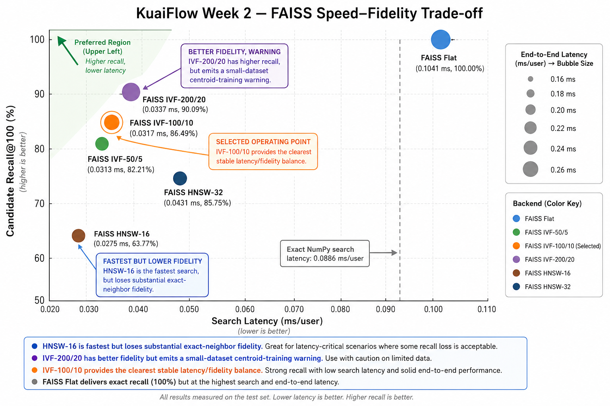

# KuaiFlow — Week 2 Two-Tower Retrieval Results

> Historical snapshot: a later [retrieval audit](retrieval_budget.md) found that equal-time training clicks could enter each other's histories. Current source fixes this. The numbers below describe the earlier implementation and are preserved for provenance; use the new budget experiment for corrected results.

Week 2 moves KuaiFlow from heuristic and matrix-factorization baselines to a
learned candidate-retrieval system. The work combines a feature- and
history-aware two-tower model with exact and approximate nearest-neighbor
retrieval, then evaluates both recommendation quality and FAISS approximation
fidelity.

The final system uses causal interaction history, excludes training-seen items,
over-fetches before filtering, and selects FAISS IVF with 100 lists and 10 probes
as the best measured latency–fidelity operating point.



## 1. Experimental setup

### Two-tower model

The user and item towers produce 64-dimensional L2-normalized embeddings:

- **User tower:** user ID, static user features, and the previous 20 clicked
  videos.
- **Item tower:** video ID, author, video/upload type, visibility, music, tag,
  duration, and dimensions.
- **Training objective:** temperature-scaled dot products with in-batch softmax
  negatives and duplicate-positive masking.
- **History aggregation:** mean pooling over earlier positive interactions using
  the same item tower used for retrieval.

History is causal for every training example: the target video and later events
are never included. At evaluation time, the user tower receives only the latest
training-period history.

### Evaluation protocol

- Strict chronological train/validation/test split established in Week 1.
- Training catalog: 7,538 videos.
- Deterministic sample: 5,000 users per validation/test split.
- Evaluation cutoffs: `K = 50` and `K = 100`.
- Training-seen positives are excluded.
- Targets are restricted to warm-start videos in the training catalog.
- Users without learned query vectors receive a popularity fallback.
- Recommendation metrics: Recall, HitRate, NDCG, and catalog Coverage.

Four controlled model variants use the same seed, dimensions, optimizer,
training schedule, and evaluation users:

1. ID-only;
2. history only;
3. static features only;
4. static features plus causal history.

## 2. Two-tower ablation study

### Test results

| Model | Recall@50 ↑ | Recall@100 ↑ | HitRate@50 ↑ | HitRate@100 ↑ | NDCG@50 ↑ | NDCG@100 ↑ | Coverage@50 ↑ | Coverage@100 ↑ |
|---|---:|---:|---:|---:|---:|---:|---:|---:|
| ID-only | 4.09% | 7.34% | 11.82% | 19.48% | 1.57% | 2.30% | 99.93% | 99.99% |
| History only | 4.62% | 8.30% | 12.68% | 21.48% | 1.75% | 2.58% | 94.71% | 98.97% |
| Feature only | 5.47% | 9.43% | 15.02% | 23.78% | 2.16% | 3.03% | **99.95%** | **100.00%** |
| **Feature + history** | **5.97%** | **10.13%** | **15.84%** | **25.08%** | **2.31%** | **3.23%** | 95.86% | 99.16% |



Static features provide the largest individual improvement. Relative to the
ID-only model, feature-only improves test Recall@50 by 33.7%, while history-only
improves it by 13.0%. Combining both components produces the strongest ranking
quality: Recall@50 improves by **46.0%**, Recall@100 by **38.1%**, and
HitRate@100 by **28.7%** relative to ID-only.

History narrows catalog reach when used alone. Static metadata recovers some of
that loss in the combined model, which retains 95.86% Coverage@50 and 99.16%
Coverage@100.

## 3. Exact versus FAISS latency

The feature/history model is trained once and its embeddings are reused by all
retrieval backends. Every backend over-fetches 269 candidates for requested
`K = 100`, ensuring that seen-item removal can still return 100 results.

Latency uses one warmup and five measured runs on one CPU thread. Three matched
boundaries are reported:

- **Search:** precomputed user embeddings through candidate search.
- **Pipeline:** search plus shared seen-item filtering and fallback.
- **End-to-end:** user embedding generation through search and post-processing.

Index construction is an offline cost and is reported separately.

| Backend | Build sec | Search median ms/user ↓ | Search p95 ↓ | Pipeline median ↓ | End-to-end median ↓ | Recall@100 ↑ | NDCG@100 ↑ |
|---|---:|---:|---:|---:|---:|---:|---:|
| Exact NumPy | N/A | 0.0886 | 0.0932 | 0.1014 | 0.2408 | 10.13% | 3.23% |
| FAISS Flat | 0.0006 | 0.1041 | 0.1052 | 0.1145 | 0.2538 | 10.13% | 3.23% |
| FAISS IVF-50/5 | 0.0045 | 0.0313 | 0.0345 | 0.0460 | 0.1846 | 10.50% | 3.33% |
| **FAISS IVF-100/10** | 0.0065 | 0.0317 | 0.0322 | 0.0444 | 0.1866 | 10.10% | 3.24% |
| FAISS IVF-200/20 | 0.0119 | 0.0337 | 0.0347 | 0.0459 | 0.1886 | 10.33% | 3.28% |
| FAISS HNSW-16 | 0.1012 | **0.0275** | 0.0553 | **0.0379** | **0.1819** | 10.21% | 3.24% |
| FAISS HNSW-32 | 0.1582 | 0.0431 | 0.0484 | 0.0554 | 0.1985 | 10.38% | 3.30% |



FAISS Flat is slower than batched NumPy exact search at this small catalog size.
The approximate indexes substantially reduce search latency, but user-vector
generation limits the end-to-end speedup. IVF-100/10 makes search approximately
2.8× faster and end-to-end retrieval approximately 1.3× faster than exact.

## 4. Approximation fidelity

Downstream click metrics alone do not show whether an ANN index recovered the
true nearest neighbors. The benchmark therefore compares every FAISS result
directly with Exact NumPy:

- **Candidate Recall@100:** fraction of exact top-100 neighbors recovered.
- **Candidate NDCG@100:** rank-sensitive agreement with exact similarity order.
- **Final overlap@100:** set overlap after seen-item filtering and fallback.
- **Ordered exact-match rate:** users whose final top-100 list exactly matches
  Exact NumPy in both membership and order.

Candidate metrics cover 4,848 test users with learned query vectors. Final-list
metrics include all 5,000 users.

| Backend | Candidate Recall@100 ↑ | Candidate NDCG@100 ↑ | Final overlap@100 ↑ | Ordered exact-match rate ↑ |
|---|---:|---:|---:|---:|
| FAISS Flat | 100.00% | 100.00% | 100.00% | 98.98% |
| FAISS IVF-50/5 | 82.21% | 89.34% | 82.44% | 4.72% |
| **FAISS IVF-100/10** | **86.49%** | **92.37%** | **86.65%** | 6.42% |
| FAISS IVF-200/20 | 90.09% | 94.69% | 90.15% | 8.16% |
| FAISS HNSW-16 | 63.77% | 78.93% | 64.18% | 3.04% |
| FAISS HNSW-32 | 85.75% | 92.76% | 85.77% | 3.20% |



FAISS Flat recovers effectively every exact candidate. Its 98.98% ordered
exact-match rate is caused by tied or numerically equivalent orderings; its
set-based overlap and downstream metrics match exact retrieval.

HNSW-16 has the fastest median search but recovers only 63.77% of exact
candidates. This loss was invisible in downstream Recall/NDCG, demonstrating why
ANN fidelity must be measured separately.

## 5. Selected operating point



**IVF-100/10 is the selected Week 2 ANN configuration.** It recovers 86.49% of
exact top-100 candidates, retains 92.37% of rank-weighted candidate quality, and
reduces exact search latency from 0.0886 to 0.0317 ms/user.

The alternatives expose clear trade-offs:

- **HNSW-16** saves only another 0.0042 ms/user at the median while losing more
  than 22 percentage points of candidate recall relative to IVF-100/10. Its
  search p95 is also less stable.
- **HNSW-32** restores fidelity to 85.75% but is slower than IVF-100/10.
- **IVF-200/20** raises candidate recall to 90.09%, but it is slower and FAISS
  warns that 7,538 vectors are below the recommended 7,800 training samples for
  200 centroids. It remains a diagnostic comparison rather than the selected
  configuration.
- **FAISS Flat** preserves exact fidelity but provides no latency benefit at the
  current catalog scale.

IVF-100/10 is therefore the clearest stable latency–fidelity knee among the
tested configurations without an index-training warning.

## 6. Main findings

1. **Static features and causal history are complementary.** Their combination
   produces the strongest retrieval quality, improving Recall@50 by 46.0% over
   ID-only.
2. **Static features provide the largest individual gain.** Feature-only is
   stronger than history-only while preserving near-complete catalog coverage.
3. **Latency must be measured at matched boundaries.** ANN search gains shrink
   end-to-end because user-vector generation is a substantial serving cost.
4. **Downstream metrics do not measure ANN correctness.** HNSW-16 preserves
   downstream Recall/NDCG despite recovering only 63.77% of exact candidates.
5. **IVF-100/10 is the best measured balance.** It provides a 2.8× search
   speedup with 86.49% exact-candidate recovery and no IVF training warning.

## 7. Limitations and next steps

- The catalog contains only 7,538 videos; ANN advantages should be reevaluated
  at larger catalog scales.
- Results use a deterministic 5,000-user offline sample and one CPU environment.
- Latency samples are repeated batched evaluation passes, not individual online
  request distributions.
- IVF and HNSW parameters were compared using a small fixed matrix rather than a
  broad hyperparameter search.
- Mean pooling treats all historical clicks equally; learned attention is a
  possible extension.
- The benchmark remains an offline warm-start evaluation under the standard
  logging policy and does not establish unbiased online impact.

Week 3 will use the retrieved candidates as input to multi-task ranking models.
Later stages will add randomized-exposure bias analysis and diversity-aware
reranking.

## 8. Reproduction

Install the project with optional FAISS support:

```bash
python -m pip install -e ".[faiss]"
```

Run the final feature/history model, selected ANN backend, and complete
trade-off analysis:

```bash
kuaiflow retrieval --config configs/week2_feature_history.yaml --mode standard
kuaiflow retrieval --config configs/week2_faiss_ivf.yaml --mode faiss
OMP_NUM_THREADS=1 kuaiflow retrieval \
  --config configs/week2_feature_history.yaml --mode tradeoff
python -m unittest discover -s tests -v
```

Generated JSON, CSV, and image artifacts remain ignored by Git. The tables and
figures in this report contain the Week 2 evidence needed to review the results.
