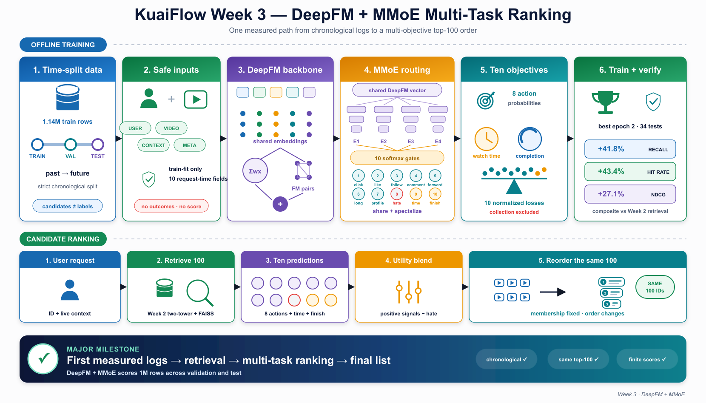
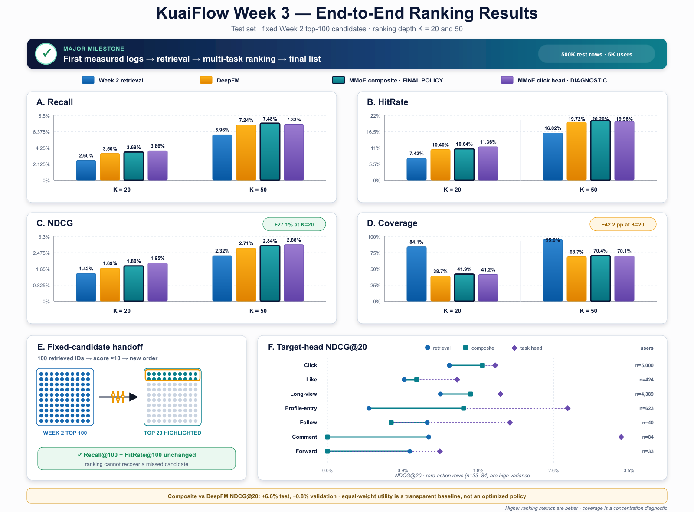

# KuaiFlow — Week 3 DeepFM + MMoE Ranking Results

Week 3 is KuaiFlow's first major end-to-end recommendation milestone. The
pipeline now starts from chronological logged impressions, retrieves candidates
with the selected Week 2 two-tower/FAISS system, scores those candidates with a
trained ranker, and produces a measured final top-100 order.

This is an **offline end-to-end result**, not an online serving or A/B-test
claim. Candidate membership remains fixed: Week 3 can improve the order of the
100 videos retrieved in Week 2, but it cannot recover a video that retrieval
missed.



## 1. What Week 3 adds

Two ranking models are evaluated over the same Week 2 candidate handoff:

1. **DeepFM:** a single-task click ranker combining first-order, pairwise FM,
   and deep interaction branches.
2. **DeepFM + MMoE:** a multi-task ranker combining task-specific first-order
   terms, a shared FM interaction, four shared experts, ten task gates, and ten
   task towers.

The MMoE model jointly predicts:

- click, like, follow, comment, forward, long view, profile entry, and hate;
- expected watch time;
- completion fraction adjusted against a train-fitted duration baseline.

Collection/save is deliberately excluded because KuaiRand-Pure does not expose
a safe timestamped per-impression collection label. Month-aggregated collection
statistics are neither valid labels nor leakage-safe request-time features.

## 2. Experimental setup

### Data and evaluation

- Strict chronological train/validation/test split.
- Training impressions: **1,141,112**.
- Validation impressions: **147,725**.
- Test impressions: **147,725**.
- Candidate evaluation: **5,000 users** and **500,000 candidate rows** for each
  of validation and test.
- Candidate set: the selected Week 2 FAISS IVF top 100 for each user.
- Random seed: **2026**.
- Ranking cutoffs: `K = 10, 20, 50, 100`; the main report uses 20 and 50.
- Ground truth: novel warm-start positives after excluding training-seen items.

Candidate files are used only for scoring and evaluation. They are never turned
into training examples, and an unexposed candidate is never treated as a
negative label.

### Leakage-safe features

Both rankers use seven categorical and three numeric request-time fields:

- categorical: user ID, video ID, author ID, video type, upload type, music ID,
  and music type;
- numeric: video duration, server width, and server height.

Vocabularies and numeric transforms are fit on training rows only. Outcomes,
dwell time, request timestamps, logging-policy fields, retrieval scores/ranks,
and month-aggregated behavior statistics are excluded from the model inputs.

### Optimization

DeepFM uses a 16-dimensional embedding, hidden layers `[128, 64]`, and one
unweighted click binary-cross-entropy loss.

DeepFM + MMoE uses:

- 16-dimensional shared embeddings;
- four expert MLPs with hidden dimensions `[128, 64]`;
- one softmax gate and one 32-unit tower per task;
- eight binary-cross-entropy action losses;
- a weighted-logistic watch-time loss whose exponentiated logit estimates
  expected watch seconds;
- a masked soft-label completion loss;
- train-only constant-predictor loss normalization across all ten tasks.

Both models use AdamW with learning rate `0.001` and weight decay `1e-6`.
MMoE uses dropout `0.1` and has **1,376,200 trainable parameters**. Both runs
completed four epochs and restored epoch 2 from chronological validation.
DeepFM trained in 10.73 seconds; MMoE trained in 60.90 seconds on the recorded
local run.

## 3. Main fixed-candidate ranking result

The following four orderings use exactly the same candidate membership:

- **Week 2 retrieval:** original FAISS retrieval order;
- **DeepFM:** single-task click score;
- **MMoE composite:** the final neutral multi-objective policy;
- **MMoE click head:** a diagnostic ordering, not the final policy.

Higher is better for Recall, HitRate, and NDCG. Coverage measures catalog-wide
exposure reach; it is a concentration diagnostic rather than a direct relevance
metric.

### Test results

| Ordering | Recall@20 | HitRate@20 | NDCG@20 | Coverage@20 | Recall@50 | HitRate@50 | NDCG@50 | Coverage@50 |
|---|---:|---:|---:|---:|---:|---:|---:|---:|
| Week 2 retrieval | 2.60% | 7.42% | 1.42% | **84.08%** | 5.96% | 16.02% | 2.32% | **95.65%** |
| DeepFM | 3.50% | 10.40% | 1.69% | 38.66% | 7.24% | 19.72% | 2.71% | 68.75% |
| **MMoE composite** | 3.69% | 10.64% | 1.80% | 41.92% | **7.48%** | **20.20%** | 2.84% | 70.44% |
| MMoE click head — diagnostic | **3.86%** | **11.36%** | **1.95%** | 41.22% | 7.33% | 19.96% | **2.88%** | 70.10% |

Relative to the original Week 2 order, the final MMoE composite improves:

- Recall@20 by **41.8%**;
- HitRate@20 by **43.4%**;
- NDCG@20 by **27.1%**.

Its test NDCG@20 is **6.6% higher than DeepFM**. The dedicated click head is
stronger still for click ranking, but it intentionally ignores the other nine
objectives and is therefore reported as a diagnostic rather than the serving
policy.



### The coverage trade-off

The relevance gains are accompanied by substantially more concentrated
recommendations. Coverage@20 falls from 84.08% in retrieval order to 38.66%
under DeepFM and 41.92% under the MMoE composite. MMoE recovers 3.26 percentage
points of coverage relative to DeepFM, but both rankers remain far below the
retrieval order.

This is a real model trade-off, not a plotting artifact. A later reranking stage
should explicitly optimize diversity and exposure rather than assuming that
relevance-only ranking will preserve catalog reach.

### K=100 proves membership is fixed

At K=100, Recall, HitRate, and Coverage are identical across all four orderings.
Only NDCG changes because the ranker changes positions within the list.

| Ordering | Recall@100 | HitRate@100 | NDCG@100 | Coverage@100 |
|---|---:|---:|---:|---:|
| Week 2 retrieval | 10.10% | 25.32% | 3.24% | 99.03% |
| DeepFM | 10.10% | 25.32% | 3.34% | 99.03% |
| MMoE composite | 10.10% | 25.32% | 3.42% | 99.03% |
| MMoE click head — diagnostic | 10.10% | 25.32% | 3.49% | 99.03% |

The equality is an important pipeline invariant: Week 3 reranks the Week 2
handoff instead of silently changing candidate generation.

## 4. Validation-to-test stability

Both trained rankers beat the retrieval order in both future periods. The
MMoE composite does not consistently dominate DeepFM, however.

| Ordering | Validation NDCG@20 | Test NDCG@20 |
|---|---:|---:|
| Week 2 retrieval | 1.335% | 1.415% |
| DeepFM | **1.682%** | 1.687% |
| MMoE composite | 1.668% | **1.799%** |
| MMoE click head — diagnostic | 1.811% | 1.947% |

The composite is 0.8% below DeepFM on validation and 6.6% above it on test.
The defensible conclusion is therefore that both rankers improve the fixed
retrieval order and MMoE adds multi-objective capability—not that the current
MMoE composite universally dominates the simpler DeepFM baseline.

## 5. Pointwise prediction results

Pointwise click classification and within-candidate ranking answer different
questions. DeepFM remains slightly stronger on logged test click prediction:

| Model | ROC-AUC | PR-AUC | Log loss ↓ |
|---|---:|---:|---:|
| **DeepFM** | **0.7195** | **0.6497** | **0.6168** |
| MMoE click head | 0.7150 | 0.6432 | 0.6172 |

This counter-result matters. MMoE's headline gain is better ordering inside the
retrieved candidate sets while learning ten objectives; it is not an
across-the-board improvement in global click classification.

### MMoE binary targets

| Target | Positive rate | ROC-AUC | PR-AUC |
|---|---:|---:|---:|
| Click | 44.59% | 0.7150 | 0.6432 |
| Like | 1.74% | **0.8448** | 0.1505 |
| Follow | 0.13% | 0.7570 | 0.0187 |
| Comment | 0.26% | 0.7460 | 0.0135 |
| Forward | 0.09% | 0.7085 | 0.0065 |
| Long view | 31.38% | 0.7212 | 0.5162 |
| Profile entry | 1.79% | 0.7321 | 0.0604 |
| Hate | 0.09% | 0.7330 | 0.0176 |

The low PR-AUC values for the rare actions are expected from their extreme
class imbalance and are a reminder not to interpret ROC-AUC alone.

### Continuous and soft targets

| Target | Test examples | MAE | RMSE |
|---|---:|---:|---:|
| Watch time | 147,725 | 23.66 seconds | 39.72 seconds |
| Completion fraction | 145,504 | 0.2653 | 0.3307 |

Completion excludes 2,221 test rows carrying the dataset's zero-duration
sentinel. Those rows still contribute to every other applicable objective.

## 6. Multi-objective candidate ranking

The neutral composite adds all positive signals and subtracts hate after
bounding the watch-time and duration-adjusted completion components. Every
default utility weight has equal magnitude. These weights are an explicit,
transparent baseline policy; they were not learned or optimized as business
utility.

The table compares target NDCG@20 on test candidates. The dedicated task-head
ordering shows whether a head learned target-specific ranking signal; the
composite shows what survives after combining all objectives.

| Target | Candidate users | Retrieval | MMoE composite | Dedicated head |
|---|---:|---:|---:|---:|
| Click | 5,000 | 1.415% | 1.799% | **1.947%** |
| Like | 424 | 0.892% | 1.035% | **1.505%** |
| Long view | 4,389 | 1.311% | 1.661% | **2.009%** |
| Profile entry | 623 | 0.480% | 1.581% | **2.789%** |
| Follow | 40 | 1.159% | 0.740% | **2.117%** |
| Comment | 84 | 1.175% | 0.000% | **3.410%** |
| Forward | 33 | 0.956% | 0.000% | **1.305%** |
| Hate — lower exposure is preferred | 25 | 0.000% | 0.000% | 1.333% |

Click, long view, and profile entry are the clearest composite improvements.
Like also improves on test but reverses on validation. Follow, comment, and
forward show that the equal-weight composite does not preserve every dedicated
head's ranking signal. Their candidate-positive cohorts contain only 33–84
users, so the estimates are too sparse for headline claims.

## 7. Key findings

1. **The full offline pipeline now works.** Logged impressions, Week 2
   retrieval, trained ranking, utility composition, final ordering, and
   evaluation are connected through persisted artifacts.
2. **Both rankers improve candidate ordering.** DeepFM improves test
   NDCG@20 by 19.2% over retrieval; the MMoE composite improves it by 27.1%.
3. **MMoE adds useful task specialization.** Dedicated heads find ranking
   signal for click and multiple secondary actions, including sparse targets.
4. **The current policy is not yet optimal.** Equal utility weights mix the
   targets transparently but hurt some rare-action orderings.
5. **Ranking concentrates exposure.** The gain in relevance comes with a
   42.16-point Coverage@20 reduction versus retrieval.
6. **Retrieval still sets the ceiling.** At K=100 the rankers cannot change
   Recall or HitRate because candidate membership is fixed.

## 8. Limitations and next steps

- Results use one seed and do not include repeated-run confidence intervals or
  significance tests.
- Evaluation is chronological and warm-start, but it remains offline and based
  on standard-policy logged exposure; it does not establish causal online lift.
- The neutral composite weights are not learned business utility.
- Coverage measures catalog-wide reach, not per-user diversity, fairness, or
  creator exposure quality.
- Candidate rows are scored only; unexposed candidates are never relabeled as
  negatives.
- Week 3 ranker inference latency has not yet been benchmarked.
- DIN is not included. The next controlled ablation should add causal
  target-aware sequence attention to this frozen DeepFM + MMoE baseline.
- A later diversity-aware reranker should address the measured coverage loss.

## 9. Reproduction and saved outputs

Run the two rankers:

```bash
OMP_NUM_THREADS=1 kuaiflow deepfm --config configs/week3_deepfm.yaml
OMP_NUM_THREADS=1 kuaiflow mmoe --config configs/week3_mmoe.yaml
```

Regenerate the editable SVG figures and website-ready PNG copies from the saved
result JSON files:

```bash
make week3-figures
```

Primary outputs:

- `data/processed/ranking/week3_deepfm_top100.csv.gz`
- `data/processed/ranking/week3_mmoe_top100.csv.gz`
- `artifacts/week3_deepfm_model.pt`
- `artifacts/week3_deepfm_encoder.json`
- `artifacts/week3_deepfm_results.json`
- `artifacts/week3_mmoe_model.pt`
- `artifacts/week3_mmoe_encoder.json`
- `artifacts/week3_mmoe_duration_curve.json`
- `artifacts/week3_mmoe_results.json`
- `artifacts/week3_mmoe_ranking_metrics.csv`

All 34 repository tests pass. The one-million-row MMoE candidate artifact
contains finite values, preserves every Week 2 `(split, user_id, video_id)`
pair, and gives every user exactly ranks 1 through 100.

## 10. Milestone conclusion

Week 3 completes the first measured offline KuaiFlow recommendation path:

```text
chronological logs
        → Week 2 two-tower + FAISS retrieval
        → fixed top-100 handoff
        → DeepFM / DeepFM + MMoE scoring
        → explicit multi-objective utility
        → final top-100 order
        → chronological evaluation
```

That end-to-end connection is the milestone. The next work should improve the
ranking model and policy through controlled DIN, utility-weight, latency, and
diversity experiments without weakening the fixed-candidate and leakage-safety
contracts established here.
