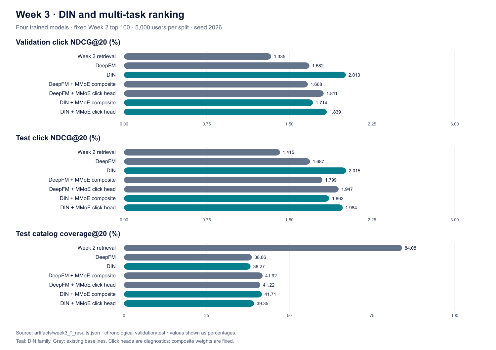

# KuaiFlow — Week 3: DeepFM, DIN, and MMoE comparison

Week 3 now compares four trained ranking models over the exact same Week 2 top-100 candidate handoff. The original retrieval order is included as a reference. All values below come from full runs, not toy examples.



## Experimental contract

- 1,141,112 training impressions; 147,725 validation and 147,725 test impressions.
- Same chronological splits, train-fitted vocabularies, seven categorical and three numeric static fields, 5,000 candidate users per split, and 100 fixed videos per user. Candidates are scored only; unexposed items are never training negatives.
- Seed 2026, CPU, one OpenMP thread, AdamW at 0.001 with weight decay 1e-6, embedding size 16, dropout 0.1, five-epoch budget and patience two. Single-task batches are 2,048; multi-task batches are 4,096, matching the existing baselines.
- Single-task models select the lowest validation click log loss. Multi-task models select the lowest validation normalized ten-task loss. Test data never selects epochs or utility weights.
- DIN uses the last 30 training clicks and a target-conditioned local activation MLP [64, 32]. Training history excludes the current impression, future events, and all events at the same timestamp. Validation, test, and candidate histories stay frozen at the training cutoff; validation outcomes never enter test history.
- DIN predicts click with an MLP [128, 64]. DIN + MMoE feeds the same attended representation to four experts [128, 64], ten task-specific softmax gates, and ten 32-unit towers. The tasks, loss normalization, duration curve, and composite utility match DeepFM + MMoE.
- This is a model-family comparison, not an isolated attention ablation: DIN replaces the DeepFM linear/FM branches as well as adding history. PReLU attention and AdamW are explicit implementation choices; this is not an exact reproduction of the DIN paper's Dice and mini-batch-aware regularization.

## Click candidate ranking

Composite rankings apply the frozen multi-objective utility. Click-head rankings show click specialization and are reported separately. Coverage is catalog reach, not per-user diversity.

### Validation

| Ordering | Recall@20 | HitRate@20 | NDCG@20 | Coverage@20 | NDCG@50 |
|---|---:|---:|---:|---:|---:|
| Week 2 retrieval | 2.696% | 7.020% | 1.335% | 83.484% | 2.183% |
| DeepFM | 3.296% | 10.360% | 1.682% | 38.286% | 2.643% |
| DIN | 3.662% | 11.540% | 2.013% | 37.702% | 2.905% |
| DeepFM + MMoE composite | 3.426% | 10.620% | 1.668% | 41.337% | 2.687% |
| DeepFM + MMoE click head | 3.484% | 10.980% | 1.811% | 40.488% | 2.778% |
| DIN + MMoE composite | 3.517% | 10.700% | 1.714% | 41.284% | 2.720% |
| DIN + MMoE click head | 3.562% | 11.100% | 1.839% | 39.228% | 2.800% |

### Test

| Ordering | Recall@20 | HitRate@20 | NDCG@20 | Coverage@20 | NDCG@50 |
|---|---:|---:|---:|---:|---:|
| Week 2 retrieval | 2.599% | 7.420% | 1.415% | 84.081% | 2.321% |
| DeepFM | 3.500% | 10.400% | 1.687% | 38.657% | 2.707% |
| DIN | 4.034% | 11.560% | 2.015% | 38.273% | 2.936% |
| DeepFM + MMoE composite | 3.686% | 10.640% | 1.799% | 41.921% | 2.835% |
| DeepFM + MMoE click head | 3.857% | 11.360% | 1.947% | 41.218% | 2.884% |
| DIN + MMoE composite | 3.879% | 11.040% | 1.862% | 41.709% | 2.829% |
| DIN + MMoE click head | 4.027% | 11.680% | 1.984% | 39.347% | 2.928% |

## Pointwise click prediction and training cost

| Model | Validation ROC-AUC | Test ROC-AUC | Test PR-AUC | Test log loss ↓ | Best epoch / completed | Training seconds | Parameters |
|---|---:|---:|---:|---:|---:|---:|---:|
| DeepFM | 0.7348 | 0.7195 | 0.6497 | 0.6168 | 2 / 4 | 9.55 | 835,223 |
| DIN | 0.7376 | 0.7233 | 0.6558 | 0.6142 | 1 / 3 | 38.03 | 796,116 |
| DeepFM + MMoE | 0.7284 | 0.7150 | 0.6432 | 0.6172 | 2 / 4 | 59.83 | 1,376,200 |
| DIN + MMoE | 0.7298 | 0.7165 | 0.6486 | 0.6151 | 2 / 4 | 95.20 | 917,007 |

Training time includes epoch validation and checkpoint selection, but excludes feature/history preparation, final evaluation, candidate scoring, and writing files. These are individual local runs, not repeated latency benchmarks.

## Multi-task target comparison

Test candidate NDCG@20 by target. Each target uses its own eligible cohort. Hate is undesirable exposure: lower values are preferred, and its dedicated ranking uses ascending predicted hate probability.

| Target | Users | DeepFM+MMoE composite | DIN+MMoE composite | DeepFM+MMoE head | DIN+MMoE head |
|---|---:|---:|---:|---:|---:|
| click | 5,000 | 1.799% | 1.862% | 1.947% | 1.984% |
| like | 424 | 1.035% | 1.009% | 1.505% | 1.387% |
| follow | 40 | 0.740% | 0.505% | 2.117% | 1.917% |
| comment | 84 | 0.000% | 0.275% | 3.410% | 3.532% |
| forward | 33 | 0.000% | 0.000% | 1.305% | 1.305% |
| long_view | 4,389 | 1.661% | 1.760% | 2.009% | 1.934% |
| profile_enter | 623 | 1.581% | 1.656% | 2.789% | 2.284% |
| hate | 25 | 0.000% | 0.000% | 1.333% | 1.051% |

### Multi-task logged prediction

| Target | DeepFM+MMoE test ROC-AUC | DIN+MMoE test ROC-AUC | DeepFM+MMoE test PR-AUC | DIN+MMoE test PR-AUC |
|---|---:|---:|---:|---:|
| click | 0.7150 | 0.7165 | 0.6432 | 0.6486 |
| like | 0.8448 | 0.8576 | 0.1505 | 0.2014 |
| follow | 0.7570 | 0.7736 | 0.0187 | 0.0281 |
| comment | 0.7460 | 0.7678 | 0.0135 | 0.0141 |
| forward | 0.7085 | 0.7116 | 0.0065 | 0.0083 |
| long_view | 0.7212 | 0.7230 | 0.5162 | 0.5216 |
| profile_enter | 0.7321 | 0.7379 | 0.0604 | 0.0615 |
| hate | 0.7330 | 0.7471 | 0.0176 | 0.0369 |

| Continuous target metric (lower is better) | DeepFM+MMoE | DIN+MMoE |
|---|---:|---:|
| Watch-time MAE, seconds | 23.6624 | 23.4592 |
| Watch-time RMSE, seconds | 39.7231 | 39.7073 |
| Completion MAE, fraction | 0.2653 | 0.2632 |
| Completion RMSE, fraction | 0.3307 | 0.3292 |

Completion metrics exclude 2,221 test rows with invalid duration. Sparse binary targets require PR-AUC and cohort sizes alongside ROC-AUC.

## Interpretation

- Among the four primary orderings, **DIN** has the highest validation NDCG@20 (2.013%). Its held-out test NDCG@20 is 2.015%.
- The highest observed test NDCG@20 among primary orderings is DIN (2.015%). This test observation is not a tuning decision.
- DIN versus DeepFM: validation: +19.7% relative NDCG@20; test: +19.4% relative NDCG@20.
- DIN+MMoE composite versus DeepFM+MMoE composite: validation: +2.8% relative NDCG@20; test: +3.5% relative NDCG@20.
- At K=100, Recall, HitRate, and Coverage match retrieval for every ordering; the comparison builder checks this invariant and verifies each saved candidate pair, retrieval rank, complete reranking, and finite numeric scores across all four million-row output files. The rankers cannot recover missing candidates.
- One seed, one history length, fixed utility weights, and different parameter counts limit causal architecture claims. No repeated-seed uncertainty or online lift is claimed. Rare-action cohorts are small. A useful next experiment is a matched mean-pooling/no-history ablation, followed by utility tuning on validation and a diversity reranker.

## Reproduce

```bash
OMP_NUM_THREADS=1 make deepfm mmoe din din-mmoe
make week3-comparison
python -m unittest discover -s tests -v
```

The comparison command reads all four `artifacts/week3_*_results.json` files and writes `artifacts/week3_model_comparison.json`, `artifacts/week3_model_comparison.csv`, this report, and `figures/Week_3_model_comparison.svg` / `.png`. DIN checkpoints include their model configuration, feature encoder, and persisted training-history index; DIN+MMoE also saves the fitted duration curve. See [DIN implementation notes](week3_din.md) for loading and inference.

Architecture references: [DIN paper](https://arxiv.org/abs/1706.06978) and [MMoE paper](https://research.google/pubs/modeling-task-relationships-in-multi-task-learning-with-multi-gate-mixture-of-experts/).
