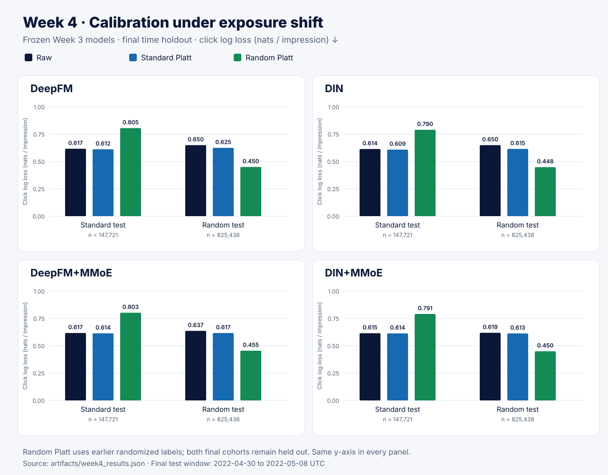
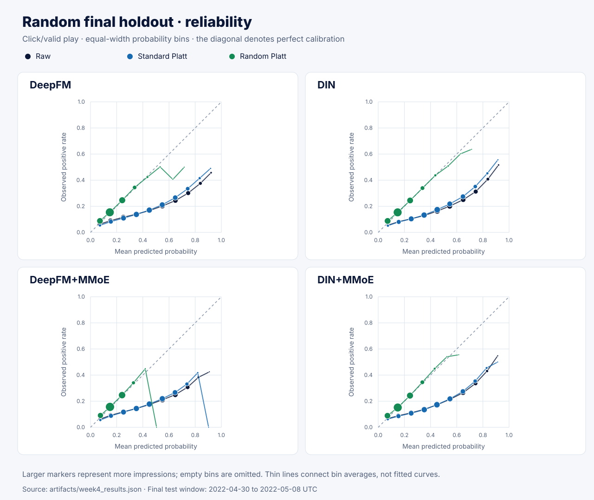

# KuaiFlow — Week 4: exposure robustness and probability calibration

Week 4 evaluates 4 frozen Week 3 models (DeepFM, DIN, DeepFM+MMoE, DIN+MMoE) on time-aligned standard-policy and randomized impressions. Standard-log Platt calibration is compared with adaptation using earlier randomized labels; later randomized impressions provide the final holdout. Every reported value is generated from the saved audit artifact.

- Random-fitted calibration lowers random-test click log loss for **4 of 4 models**, while increasing standard-test log loss for **4 of 4 models**. The calibration map depends on the exposure distribution.
- **DIN**: random-test log loss changes from 0.6500 raw to 0.4482 with random calibration; standard calibration changes standard-test log loss from 0.6142 to 0.6090.
- Scenario mix differs: `tab=1` represents **77.12%** of standard final impressions and **99.48%** of random final impressions. The shared-scenario analysis below checks whether the broad calibration result persists within that scenario.



## Protocol and data boundaries

- Training ends at **2022-04-21 15:52:08 UTC**.
- Both calibration cohorts use the cutoff **2022-04-30 03:55:09 UTC**; their last observed timestamps can differ.
- The common final test window is **2022-04-30 03:55:11 UTC** through **2022-05-08 15:52:08 UTC**; final rows are strictly later than the calibration cutoff.
- Base-model weights, encoders, and DIN training histories remain frozen. The original standard validation period already selected training epochs and now fits standard calibration; it is not an untouched validation set. Neither final cohort fits calibrators or selects a variant.
- Early randomized labels fit the random calibrator. This is explicit target-policy adaptation followed by a future holdout, so the entire random log is no longer an untouched audit set.
- Each Platt map uses the model's binary score only. A positive slope preserves single-head score ordering, apart from numerical clipping/ties; a one-class fallback is a constant and can collapse that ordering. Composite utility and candidate rankings are not recalculated.
- Random rows excluded at or before the training cutoff: **0**. Rows outside the common test window: `{"random_test": 0, "standard_test": 4}`.

| Cohort | Rows | Users | Videos | Click rate | First impression | Last impression |
| --- | --- | --- | --- | --- | --- | --- |
| Standard training | 1,141,112 | 26,210 | 7,538 | 46.34% | 2022-04-09 03:46:03 UTC | 2022-04-21 15:52:08 UTC |
| Standard calibration | 147,725 | 23,355 | 6,112 | 44.41% | 2022-04-21 15:52:11 UTC | 2022-04-30 03:55:09 UTC |
| Random calibration | 360,621 | 21,879 | 7,553 | 16.76% | 2022-04-22 02:42:12 UTC | 2022-04-30 03:55:08 UTC |
| Standard test | 147,721 | 23,199 | 5,824 | 44.59% | 2022-04-30 03:55:14 UTC | 2022-05-08 15:51:52 UTC |
| Random test | 825,438 | 26,734 | 7,384 | 17.99% | 2022-04-30 03:55:11 UTC | 2022-05-08 15:52:08 UTC |

`is_click` represents a click in the two-column interface and valid play in the single-column interface. `tab` identifies a recommendation scenario and is not a verified UI label. Pure contains a restricted video pool and incomplete interaction histories. See the [official KuaiRand field definitions](https://kuairand.com/).

## Final click prediction

Log loss, Brier score, and ECE are lower-is-better; ROC-AUC and average precision are higher-is-better. `PR-AUC` below means average precision, not trapezoidal PR integration. ECE is the count-weighted absolute probability gap in equal-width bins; it depends on the chosen binning. Full reliability-bin counts are saved with the audit.

### Standard test

| Model | Calibration | ROC-AUC | PR-AUC | Log loss ↓ | Brier ↓ | ECE ↓ | Mean prediction |
| --- | --- | --- | --- | --- | --- | --- | --- |
| DeepFM | Raw | 0.7195 | 0.6497 | 0.6168 | 0.2135 | 0.0363 | 47.37% |
| DeepFM | Standard Platt | 0.7195 | 0.6497 | 0.6119 | 0.2120 | 0.0172 | 46.28% |
| DeepFM | Random Platt | 0.7195 | 0.6497 | 0.8054 | 0.2897 | 0.2605 | 18.59% |
| DIN | Raw | 0.7233 | 0.6558 | 0.6142 | 0.2128 | 0.0432 | 48.79% |
| DIN | Standard Platt | 0.7233 | 0.6558 | 0.6090 | 0.2108 | 0.0188 | 46.43% |
| DIN | Random Platt | 0.7233 | 0.6558 | 0.7905 | 0.2831 | 0.2527 | 19.32% |
| DeepFM+MMoE | Raw | 0.7150 | 0.6432 | 0.6172 | 0.2145 | 0.0352 | 47.74% |
| DeepFM+MMoE | Standard Platt | 0.7150 | 0.6432 | 0.6143 | 0.2133 | 0.0183 | 46.40% |
| DeepFM+MMoE | Random Platt | 0.7150 | 0.6432 | 0.8029 | 0.2905 | 0.2576 | 18.83% |
| DIN+MMoE | Raw | 0.7165 | 0.6486 | 0.6151 | 0.2135 | 0.0271 | 46.93% |
| DIN+MMoE | Standard Platt | 0.7165 | 0.6486 | 0.6138 | 0.2130 | 0.0210 | 46.65% |
| DIN+MMoE | Random Platt | 0.7165 | 0.6486 | 0.7914 | 0.2846 | 0.2516 | 19.43% |

### Random test

| Model | Calibration | ROC-AUC | PR-AUC | Log loss ↓ | Brier ↓ | ECE ↓ | Mean prediction |
| --- | --- | --- | --- | --- | --- | --- | --- |
| DeepFM | Raw | 0.6518 | 0.2871 | 0.6498 | 0.2286 | 0.2615 | 44.14% |
| DeepFM | Standard Platt | 0.6518 | 0.2871 | 0.6249 | 0.2184 | 0.2547 | 43.47% |
| DeepFM | Random Platt | 0.6518 | 0.2871 | 0.4501 | 0.1410 | 0.0080 | 17.23% |
| DIN | Raw | 0.6575 | 0.2961 | 0.6500 | 0.2290 | 0.2726 | 45.25% |
| DIN | Standard Platt | 0.6575 | 0.2961 | 0.6153 | 0.2139 | 0.2517 | 43.16% |
| DIN | Random Platt | 0.6575 | 0.2961 | 0.4482 | 0.1404 | 0.0062 | 17.39% |
| DeepFM+MMoE | Raw | 0.6328 | 0.2656 | 0.6367 | 0.2243 | 0.2566 | 43.65% |
| DeepFM+MMoE | Standard Platt | 0.6328 | 0.2656 | 0.6170 | 0.2154 | 0.2469 | 42.68% |
| DeepFM+MMoE | Random Platt | 0.6328 | 0.2656 | 0.4554 | 0.1428 | 0.0085 | 17.14% |
| DIN+MMoE | Raw | 0.6521 | 0.2900 | 0.6191 | 0.2159 | 0.2476 | 42.76% |
| DIN+MMoE | Standard Platt | 0.6521 | 0.2900 | 0.6131 | 0.2132 | 0.2476 | 42.75% |
| DIN+MMoE | Random Platt | 0.6521 | 0.2900 | 0.4502 | 0.1409 | 0.0058 | 17.41% |

### Constant-prediction controls

Each constant is fitted on its named calibration cohort, including any smoothing used by the implementation. These controls show how much improvement is available from a prevalence adjustment alone. They are shared across model families; the table reads the first model's identical controls.

| Test cohort | Control | Prediction | Log loss ↓ | Brier ↓ | ECE ↓ |
| --- | --- | --- | --- | --- | --- |
| Standard test | Standard constant | 44.41% | 0.6873 | 0.2471 | 0.0018 |
| Standard test | Random constant | 16.76% | 0.8981 | 0.3245 | 0.2783 |
| Random test | Standard constant | 44.41% | 0.6276 | 0.2173 | 0.2642 |
| Random test | Random constant | 16.76% | 0.4718 | 0.1477 | 0.0123 |

### Randomized holdout reliability



Every panel uses the same probability axes. Bin averages describe the held-out observations; connected points do not represent an additional fitted calibration model. Very small bins can have unstable observed rates, visible as tiny markers at the extremes.

## Paired uncertainty for click calibration

The estimates are **calibrated minus raw** on the same impressions. Negative differences improve the loss. The bootstrap resamples users with replacement, retaining their impression clusters and pairing raw/calibrated scores. Intervals condition on the fitted models and calibrators; they do not include retraining uncertainty, cross-user dependence, or multiple-comparison adjustment.

Bootstrap settings: 500 replicates, confidence level 95.00%, seed 2026. Full replicate counts, cohort sizes, and method names are in the saved JSON.

| Model | Cohort | Calibration | Δ log loss | Confidence interval | Δ Brier | Confidence interval |
| --- | --- | --- | --- | --- | --- | --- |
| DeepFM | Standard test | Standard Platt | -0.0049 | [-0.0060, -0.0041] | -0.0016 | [-0.0018, -0.0014] |
| DeepFM | Standard test | Random Platt | +0.1887 | [+0.1821, +0.1949] | +0.0761 | [+0.0738, +0.0783] |
| DeepFM | Random test | Standard Platt | -0.0249 | [-0.0257, -0.0241] | -0.0102 | [-0.0105, -0.0100] |
| DeepFM | Random test | Random Platt | -0.1997 | [-0.2031, -0.1959] | -0.0876 | [-0.0891, -0.0860] |
| DeepFM+MMoE | Standard test | Standard Platt | -0.0028 | [-0.0033, -0.0024] | -0.0012 | [-0.0014, -0.0010] |
| DeepFM+MMoE | Standard test | Random Platt | +0.1858 | [+0.1804, +0.1913] | +0.0760 | [+0.0735, +0.0784] |
| DeepFM+MMoE | Random test | Standard Platt | -0.0197 | [-0.0200, -0.0193] | -0.0089 | [-0.0091, -0.0088] |
| DeepFM+MMoE | Random test | Random Platt | -0.1813 | [-0.1845, -0.1781] | -0.0815 | [-0.0829, -0.0801] |
| DIN | Standard test | Standard Platt | -0.0052 | [-0.0060, -0.0046] | -0.0020 | [-0.0022, -0.0018] |
| DIN | Standard test | Random Platt | +0.1763 | [+0.1704, +0.1817] | +0.0703 | [+0.0679, +0.0725] |
| DIN | Random test | Standard Platt | -0.0346 | [-0.0352, -0.0340] | -0.0151 | [-0.0153, -0.0148] |
| DIN | Random test | Random Platt | -0.2017 | [-0.2052, -0.1982] | -0.0886 | [-0.0901, -0.0871] |
| DIN+MMoE | Standard test | Standard Platt | -0.0013 | [-0.0016, -0.0011] | -0.0005 | [-0.0006, -0.0004] |
| DIN+MMoE | Standard test | Random Platt | +0.1763 | [+0.1715, +0.1811] | +0.0712 | [+0.0690, +0.0733] |
| DIN+MMoE | Random test | Standard Platt | -0.0060 | [-0.0063, -0.0057] | -0.0027 | [-0.0028, -0.0026] |
| DIN+MMoE | Random test | Random Platt | -0.1689 | [-0.1720, -0.1657] | -0.0750 | [-0.0763, -0.0736] |

## Multi-task binary heads on the random final holdout

Only binary action heads receive probability calibration. Watch time and completion are continuous targets and remain outside this calibration analysis. The table includes rare-event prevalence and average precision because ROC-AUC alone can obscure sparse positives. Missing class-dependent metrics are undefined, not zero.

| Model | Target | Positive rate | Raw PR-AUC | Raw log loss | Standard Platt log loss | Random Platt log loss | Random Platt ECE |
| --- | --- | --- | --- | --- | --- | --- | --- |
| DeepFM+MMoE | click | 17.99% | 0.2656 | 0.6367 | 0.6170 | 0.4554 | 0.008476 |
| DeepFM+MMoE | like | 0.48% | 0.0447 | 0.0331 | 0.0331 | 0.0262 | 0.000183 |
| DeepFM+MMoE | follow | 0.03% | 0.0015 | 0.0032 | 0.0032 | 0.0024 | 0.000015 |
| DeepFM+MMoE | comment | 0.04% | 0.0012 | 0.0044 | 0.0044 | 0.0032 | 0.000048 |
| DeepFM+MMoE | forward | 0.03% | 0.0014 | 0.0035 | 0.0031 | 0.0029 | 0.000044 |
| DeepFM+MMoE | long_view | 8.68% | 0.1544 | 0.4403 | 0.4230 | 0.2827 | 0.003839 |
| DeepFM+MMoE | profile_enter | 0.58% | 0.0092 | 0.0449 | 0.0417 | 0.0351 | 0.000591 |
| DeepFM+MMoE | hate | 0.12% | 0.0260 | 0.0088 | 0.0085 | 0.0084 | 0.000073 |
| DIN+MMoE | click | 17.99% | 0.2900 | 0.6191 | 0.6131 | 0.4502 | 0.005791 |
| DIN+MMoE | like | 0.48% | 0.0781 | 0.0300 | 0.0330 | 0.0252 | 0.000477 |
| DIN+MMoE | follow | 0.03% | 0.0018 | 0.0030 | 0.0032 | 0.0023 | 0.000031 |
| DIN+MMoE | comment | 0.04% | 0.0017 | 0.0039 | 0.0043 | 0.0031 | 0.000033 |
| DIN+MMoE | forward | 0.03% | 0.0013 | 0.0034 | 0.0031 | 0.0029 | 0.000050 |
| DIN+MMoE | long_view | 8.68% | 0.1718 | 0.4263 | 0.4242 | 0.2797 | 0.003227 |
| DIN+MMoE | profile_enter | 0.58% | 0.0109 | 0.0432 | 0.0429 | 0.0348 | 0.000414 |
| DIN+MMoE | hate | 0.12% | 0.0297 | 0.0089 | 0.0086 | 0.0083 | 0.000051 |

## Shared scenario and exposure composition

The `tab=1` subset below compares the same recorded scenario, without interpreting that number as a specific UI. It does not hold user/video mix fixed or identify a causal exposure-policy effect. Full click subgroups are retained in the metric artifact.

| Model | Cohort, tab=1 | Rows | Click rate | Raw log loss | Standard Platt log loss | Random Platt log loss |
| --- | --- | --- | --- | --- | --- | --- |
| DeepFM | Standard test | 113,917 | 49.34% | 0.6394 | 0.6343 | 0.8706 |
| DeepFM | Random test | 821,181 | 18.08% | 0.6503 | 0.6253 | 0.4515 |
| DIN | Standard test | 113,917 | 49.34% | 0.6366 | 0.6325 | 0.8537 |
| DIN | Random test | 821,181 | 18.08% | 0.6502 | 0.6157 | 0.4496 |
| DeepFM+MMoE | Standard test | 113,917 | 49.34% | 0.6401 | 0.6377 | 0.8685 |
| DeepFM+MMoE | Random test | 821,181 | 18.08% | 0.6369 | 0.6172 | 0.4567 |
| DIN+MMoE | Standard test | 113,917 | 49.34% | 0.6373 | 0.6356 | 0.8544 |
| DIN+MMoE | Random test | 821,181 | 18.08% | 0.6193 | 0.6132 | 0.4515 |

Exposure comparisons below are descriptive. Total variation distance is half the sum of absolute differences between normalized marginal frequencies; it is not a propensity estimate.

| Exposure marginal | Total variation | Jensen–Shannon, bits | Shared IDs |
| --- | --- | --- | --- |
| User frequencies | 0.5166 | 0.2906 | 22,870 |
| Video frequencies | 0.6209 | 0.4100 | 5,818 |
| Scenario frequencies | 0.2272 | 0.1234 | 4 |

| Cohort | tab=1 share | Training head-item share | Training tail-item share | Unseen item share |
| --- | --- | --- | --- | --- |
| Standard test | 77.12% | 68.40% | 31.59% | 0.01% |
| Random test | 99.48% | 18.91% | 80.51% | 0.58% |

Head items are the top 20% of training items by exposure count, with item-ID tie breaking; tail items are the remaining known training items. Percentages weight impressions, and neither segment uses final labels.

| Cohort | Unseen training-user row rate | Unseen training-video row rate |
| --- | --- | --- |
| Standard test | 3.70% | 0.01% |
| Random test | 3.05% | 0.58% |

## Calibrator fits and interpretation

| Model | Head | Calibration | Slope | Intercept | Fit status |
| --- | --- | --- | --- | --- | --- |
| DeepFM | click | Standard Platt | 0.8365 | -0.0621 | positive_platt: converged |
| DeepFM | click | Random Platt | 0.5883 | -1.5141 | positive_platt: converged |
| DeepFM+MMoE | click | Standard Platt | 0.8933 | -0.0667 | positive_platt: converged |
| DeepFM+MMoE | click | Random Platt | 0.5901 | -1.4806 | positive_platt: converged |
| DIN | click | Standard Platt | 0.8927 | -0.1148 | positive_platt: converged |
| DIN | click | Random Platt | 0.6896 | -1.5305 | positive_platt: converged |
| DIN+MMoE | click | Standard Platt | 0.9178 | -0.0195 | positive_platt: converged |
| DIN+MMoE | click | Random Platt | 0.6775 | -1.4375 | positive_platt: converged |

Click fits and any nonstandard fit status are shown above; all head parameters are persisted. A one-class calibration sample uses a smoothed constant fallback. A calibrated probability can improve proper scoring rules without improving ranking, and a strictly increasing map cannot fix discrimination errors.

- **DeepFM**, random test: raw log loss 0.6498; standard Platt 0.6249; random Platt 0.4501 (random-minus-raw -0.1997).
- **DIN**, random test: raw log loss 0.6500; standard Platt 0.6153; random Platt 0.4482 (random-minus-raw -0.2017).
- **DeepFM+MMoE**, random test: raw log loss 0.6367; standard Platt 0.6170; random Platt 0.4554 (random-minus-raw -0.1813).
- **DIN+MMoE**, random test: raw log loss 0.6191; standard Platt 0.6131; random Platt 0.4502 (random-minus-raw -0.1689).

These are fixed-variant observations on the final holdout, not a procedure for choosing a new production calibrator. Comparing the two exposure cohorts combines policy, user/video composition, and scenario effects even with time alignment. No logged per-impression propensities are supplied to this pipeline, so it performs no IPS/DR off-policy estimation and makes no unbiased policy-value or online-lift claim.

## Reproduce

```bash
OMP_NUM_THREADS=1 make week4
make week4-report
python -m unittest discover -s tests -v
```

The audit reads the selected saved Week 3 checkpoints and configuration paths in `configs/week4.yaml`. It saves metrics, reliability bins, calibrator parameters, cohort diagnostics, and paired uncertainty in `artifacts/week4_results.json`; the report builder reads that artifact to regenerate this page and the calibration/reliability SVG figures. Matching PNGs are produced when `rsvg-convert` is installed. See [Week 4 implementation notes](week4.md) for the equations and constraints.

References: [KuaiRand dataset and fields](https://kuairand.com/), [probability calibration background](https://scikit-learn.org/1.4/modules/calibration.html).
